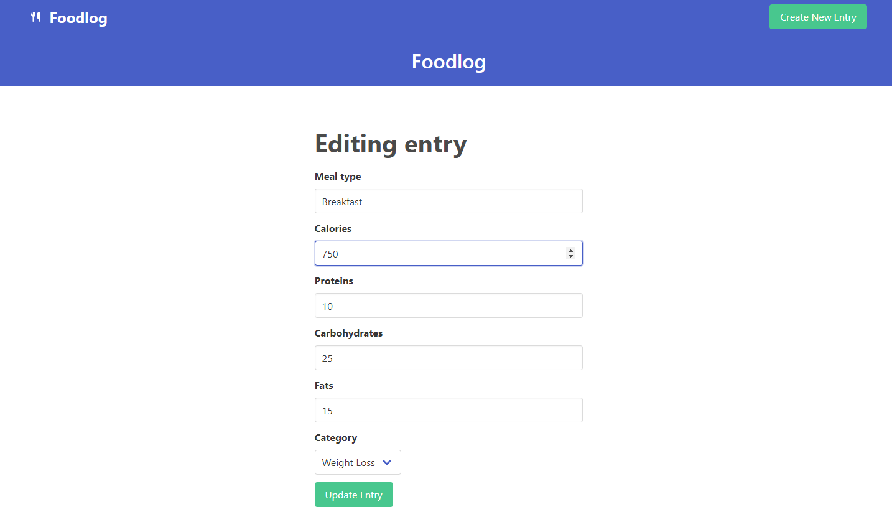

# Ruby on Rails "Food Log"

This is my second exposure to Ruby on Rails. I followed this "crash course" video to build a food log app.

<a href="https://www.youtube.com/watch?v=B3Fbujmgo60" target="_blank">https://www.youtube.com/watch?v=B3Fbujmgo60</a>

In this app, users can enter meal logs, access specific entries, view today's entries, and view all entries. Users can create, update, and delete entries. The app uses Bulma for simple styling.

  

  

  

  

  

